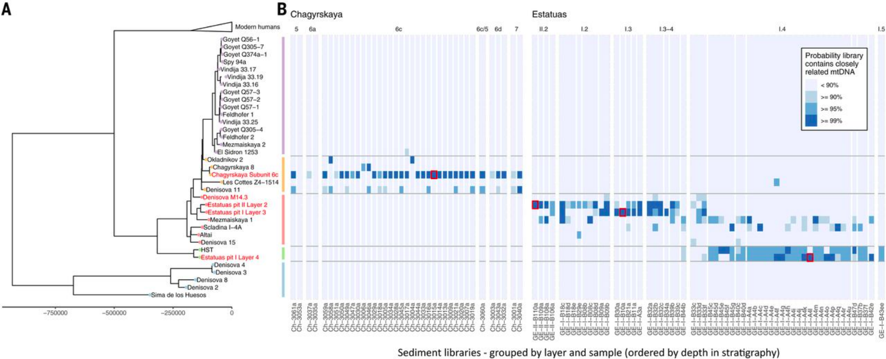

# Hominin mtDNA Kallisto Pipeline

This pipeline runs on a folder with BAM-files and creates a kallisto-plot similar to the one created by Vernot et al. 2021 (and the data-file for custom plotting) 
 


## Requirements

singularity

## Usage

```
nextflow run merszym/kallisto_nf -r v0.1 --split INPUT-DIR
```

INPUT-DIR is a directory containing BAM-files (e.g. unique or deaminated sequences, mapped to the human mtDNA reference genome)

## Details

The pipeline includes a Kallisto-index containing 95 hominin mitochondrial mtDNA reference genomes:

<pre>
cols = [
        "rCRS_NC_012920",
        "AF347008",
        "AF346999",
        "AF381988",
        "AY195766",
        "AF381981",
        "AF346995",
        "AF346977",
        "AY289097",
        "AY289082",
        "AY289085",
        "DQ137410",
        "DQ137411",
        "AF347015",
        "AY195759",
        "AF347014",
        "AF381998",
        "AY950293",
        "AY950300",
        "AF346973",
        "AF381996",
        "AF381984",
        "AF347010",
        "AY963573",
        "AF346990",
        "AY195748",
        "AF346966",
        "AY289059",
        "AY195756",
        "AF381999",
        "AY882393",
        "AY882380",
        "AY195754",
        "AY195774",
        "AY963586",
        "AY882382",
        "AY963572",
        "AY195787",
        "AY195773",
        "AF382000",
        "AY882392",
        "AY882391",
        "AY882412",
        "AY882403",
        "AY882388",
        "AY882386",
        "AY289094",
        "AY289101",
        "AY882389",
        "AY882390",
        "AF381997",
        "AY195757",
        "AF346975",
        "AF346981",
        "AY882416",
        "Ust_Ishim",
        "BS11",
        "Loschbour",
        "Tianyuan",
        "Kostenki14",
        "Iceman",
        "Eskimo_Saqqaq",
        "Oberkassel998",
        "DolniVestonice14",
        "DolniVestonice13",
        "GoyetQ374a-1",
        "GoyetQ305-7",
        "GoyetQ56-1",
        "Spy_94a",
        "Vindija33.19",
        "Vindija33.16",
        "Vindija33.17",
        "GoyetQ57-3",
        "GoyetQ57-2",
        "Feldhofer1",
        "Vindija33.25",
        "GoyetQ305-4",
        "Feldhofer2",
        "Mezmaiskaya2",
        "ElSidron1253",
        "Chagyrskaya08",
        "Okladnikov2",
        "Les_Cottes_Z4-1514",
        "DC1227",
        "Mezmaiskaya1",
        "Denisova15",
        "Altai",
        "Scladina_I-4A",
        "HST",
        "Denisova4",
        "Denisova3",
        "Denisova8",
        "Denisova2",
        "Sima_de_los_Huesos",
        "Chimpanzee"
    ]
</pre>
